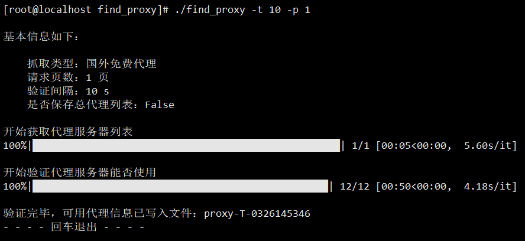
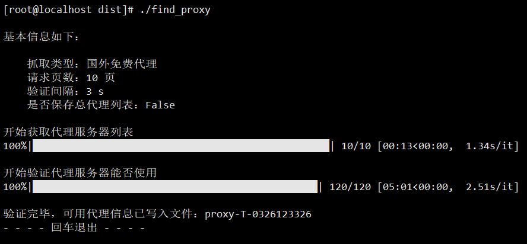
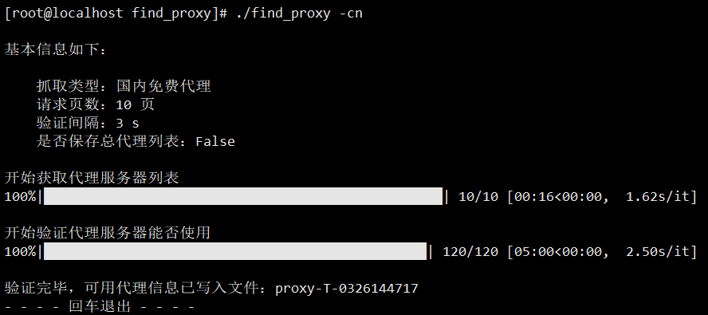
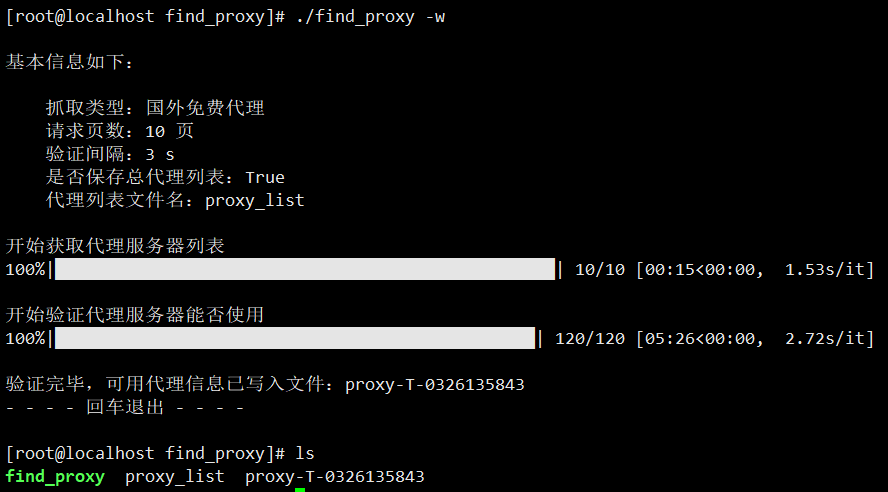
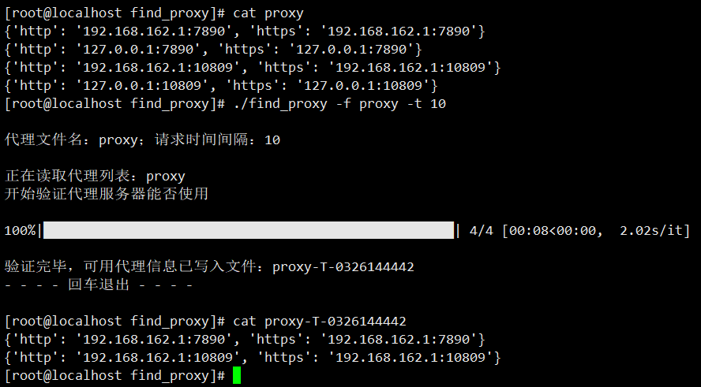

# find_proxy

>@模块功能 : IP 地址/代理服务器查询验证
>@开发环境 : Python3.10
>@开发平台 : Pycharm
>@注意事项 : 需要联网

## 工具介绍

​	find_proxy 爬取网站上免费的代理服务器地址，并验证地址是否可用，将可用的代理地址输出到文件内

## 参数

~~~
usage: find_proxy [-h] [-t] [-p] [-w] [-cn] [-f]

该工具用于抓取网络上免费的代理服务器，数据来源：快代理； 
下载地址：https://github.com/xiaolin8686/Python_tools/tree/main/find_proxy

options:
  -h, --help    show this help message and exit
  -t , --time   代理请求超时时间，用于验证代理是否可用，默认时间为 3s，建议 5s
  -p , --page   抓取代理页数，默认 10 页
  -w, --write   写入全部代理服务器信息，默认不写入；加入 -w 开启写入
  -cn, --china  默认访问国外代理列表，加入 -cn 则访问国内代理列表
  -f , --file   代理列表文件(相对|绝对)路径，判断代理列表内可用代理服务器，默认为空

~~~

## 使用

**命令模板**

~~~bash
# 从网络中获取可用代理
find_proxy -t [请求时间] -p [整数数字] [-w(可选，保存全部代理信息)/-cn(可选，抓取国内代理)]

# 从文件中获取可用代理
find_proxy -f [文件绝对/相对路径] -t [请求时间]
~~~

### 直接执行

> 默认抓取**国外**免费代理服务器，请求页数 10 页（每页代理个数 12 个），验证间隔 3 s，不保存总代理列表

### 抓取国内代理

> -cn 抓取国内免费代理

### 保存总代理列表

> -w 将未验证代理写入文件 proxy_list 内

### 筛选文件内可用代理

> -f 验证文件中保存的代理地址是否可用
> 若文件内的代理地址均不可用，则不会生成新的文件

