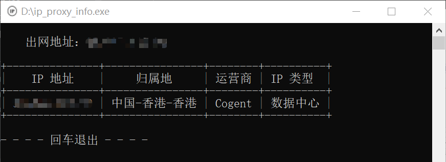
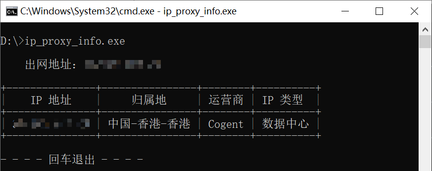
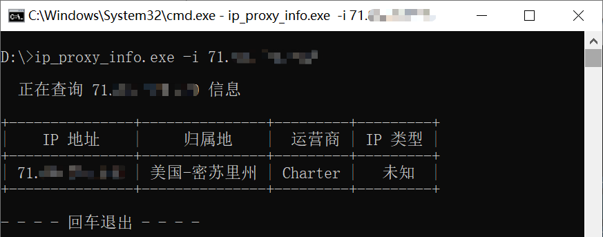
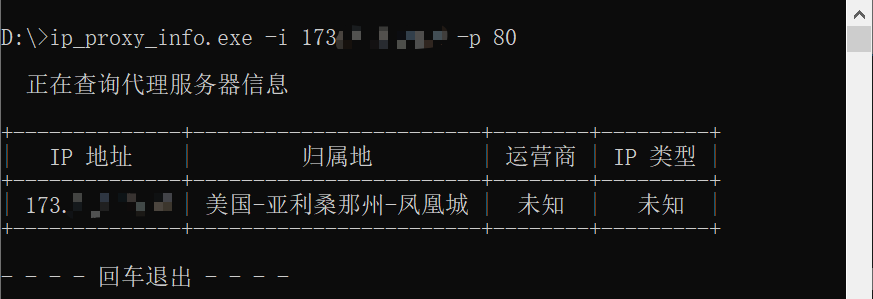

# ip_proxy_info

>@模块功能 : IP 地址/代理服务器查询验证
>
>@开发环境 : Python3.10
>
>@开发平台 : Pycharm
>
>@注意事项 : 需要联网

## 工具介绍

&nbsp;&nbsp;&nbsp;&nbsp;ip_proxy_info 用于判断 IP 地址以及 IP 地址的所属国家。可用于判断出网 IP 以及代理 IP 地址信息

&nbsp;&nbsp;&nbsp;&nbsp;可以用来测试代理服务器是否可用，以及是否挂了代理

&nbsp;&nbsp;&nbsp;&nbsp;数据来源：ipshudi.com

## 参数

~~~
usage: ip_proxy_info.exe [-h] [-i] [-p]

该工具用于判断 IP 地址以及 IP 地址的所属国家。可用于查询出网 IP 以及代理 IP 地址信息；
使用文档：https://github.com/xiaolin8686/Python_tools/tree/main/ip_proxy_info

options:
  -h, --help    show this help message and exit
  -i , --ip     输入查询 IP 地址。
  -p , --port   默认为空，用于查询代理服务器地址信息
~~~

## 使用

### 查询本机出网 IP 地址

**方法一：双击执行程序自动查询本机出网 IP 地址**

**方法二：命令行启动程序**

### 查询特定 IP 地址信息

~~~bash
select_ip_proxy -i [IP地址]
~~~

### 查询代理服务器信息/判断代理服务器是否可用

~~~bash
select_ip_proxy -i [代理地址] -p [代理端口]
~~~

