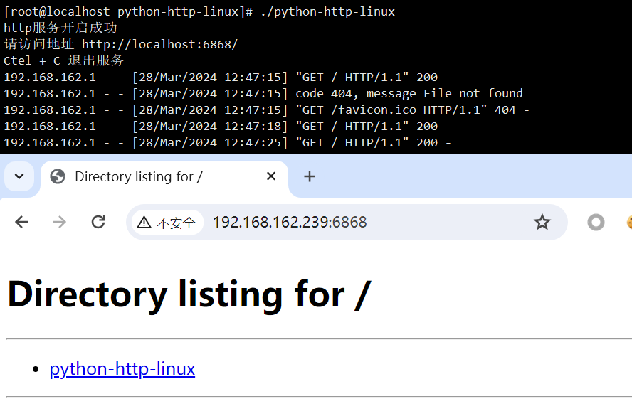
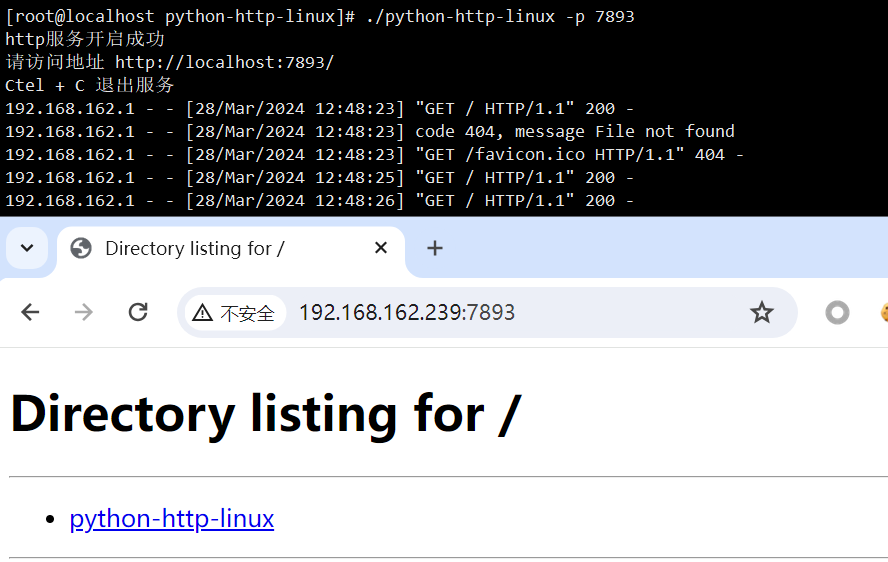

# python-http

>@模块功能 : 本地代理工具
>
>@开发环境 : Python3.10
>
>@开发平台 : Pycharm
>
>@注意事项 : 需要联网

## 工具介绍

​	python-http 用于开启一个临时 http 服务，指定特定端口，代理本地目录，时间本地目录文件共享功能。

​	在使用的过程中，需要指定空闲端口，否则临时 http 服务无法开启，默认开启 6868 端口，可使用 -p 参数指定其他端口

## 参数

~~~
usage: python-http-linux [-h] [-p]

小型 http 服务器，可指定端口(指定端口不能被其他服务占用)
下载地址：https://github.com/xiaolin8686/Python_tools/releases/

options:
  -h, --help    show this help message and exit
  -p , --port   指定端口，默认开启端口为 6868
~~~

## 使用

### 直接运行

### 指定端口

~~~bash
python-http -p [本地端口]
~~~

