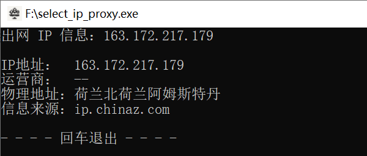
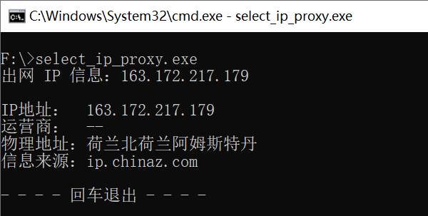
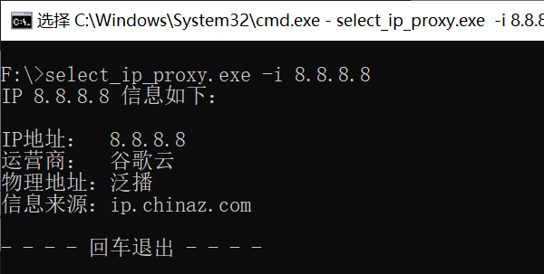
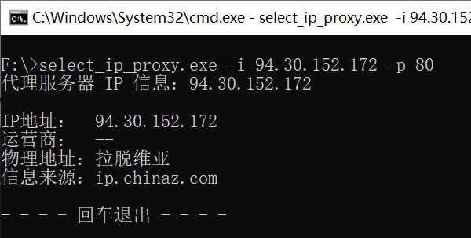

# select_ip_proxy

>@模块功能 : IP 地址/代理服务器查询验证
>@开发环境 : Python3.10
>@开发平台 : Pycharm
>@注意事项 : 需要联网

## 工具介绍

​	select_ip_proxy.exe 用于判断 IP 地址以及 IP 地址的所属国家。可用于判断出网 IP 以及代理 IP 地址信息

​	可以用来测试代理服务器是否可用，以及是否挂了代理

​	在 fofa 测试通用 poc 的时候，也可以用它来验证 IP 地址是否是国内 IP （暂时不支持域名查询）

​	数据来源：站长之家(ip.chinaz.com)

## 参数

~~~
usage: select_ip_proxy.exe [-h] [-i IP] [-p PORT]

该工具用于判断 IP 地址以及 IP 地址的所属国家。可用于判断出网 IP 以及代理 IP 地址信息；消息来源为站长之家(ip.chinaz.com)
下载地址：https://github.com/xiaolin8686/Python_tools/tree/main/select_ip_proxy

options:
  -h, --help            show this help message and exit
  -i IP, --ip IP        输入查询 IP 地址，为空自动查询本机出网 IP 地址。
  -p PORT, --port PORT  默认为空，用于查询代理服务器地址信息
~~~

## 使用

### 查询本机出网 IP 地址

**方法一：双击执行程序自动查询本机出网 IP 地址**

**方法二：命令行启动程序**

### 查询特定 IP 地址信息

~~~bash
select_ip_proxy.exe -i [IP地址]
~~~

### 查询代理服务器信息/判断代理服务器是否可用

~~~bash
select_ip_proxy.exe -i [代理地址] -p [代理端口]
~~~

